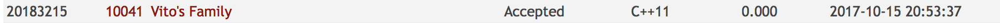

# Solution
We need to find the sum of each elements absolute distance to the
median as this is the *central* house.
This comes down to finding the median of an array and it is thus a
partial sorting problem.

Approach | Runtime
--- | ---
Sort the array and pick the median. | nlogn
Randomized selection see [test](test)  | n on average
Median selection see  | n worst case

Approach | Code | Result
--- | --- | ---
Randomized selection | [vito_random](vito_random.c) | 
Median selection | [vito_median](vito_median.c) | 
C++ stl selection | [vito_stl](vito_stl.cpp)  | 

Surprisingly the randomized approach performs better because finding
the median of medians generates more overhead on average.