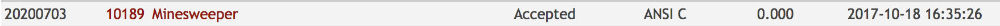

# Solution

This exercise is about processing and handling 2d arrays. There is no
special algorithm or data structure needed.

## My approach:
1. I iterate through the whole 2d minesweeper field and replace each '.'
value with '0' and store each mine's position.
2. I then iterate through all the found mines and increment each mine's
neighbour by 1. This is possible because I changed all the neighbours
from '.' to '0' in the first step.
3. Print the whole 2d array.

## Analysis:
n = rows * columns

m = number of mines

Time = n (step 1) + m (step 2) + n (step 3) = **2n + m**

Code | Result
--- | ---
[10189_minesweeper](10189_minesweeper.c) | 
