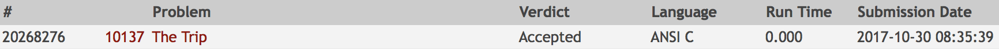

# Solution

This exercise is about floating-point arithmetic and tricky rounding.
There is no special algorithm or data structure needed.

## My approach:
1. We save each expense in an array position and calculate the sum of
all expenses.
2. We calculate the average.
3. We find the minimum difference sum from the average.
We need to consider two things:
    * There is a negative sum and a positive sum. In the end we need
    the maximum of these two otherwise we may have 0.01 cents too less.
    * As we only have a precision of 2 decimals we need to round after
    each addition.

## Analysis:
n is the number of students and thus also expenses.
1. Takes n times
2. Is constant
3. Takes n times
T = O(n) + O(1) + O(n) = O(2 * n) = O(n)

Code | Result
--- | ---
[10137_trip.c](10137_trip.c) | 
