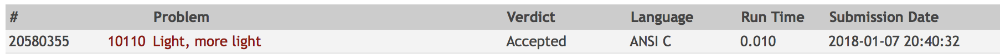

# Solution

This exercise boils down to checking if the number is a perfect square
or not.

## Easiest but boring approach:
1. Calculate the square root of the number n by using the sqrt function
provided by the math library.
2. Round it to int and square it again.
3. Check if the number is the same as n.

## My approach:
1. If the number ends in 2, 3, 7 or 8 it is NOT a perfect square. So I
check for the last digit. Cost: O(number of digits / 10) ~= O(1)
2. If the last digit is not one of the above I find the perfect square
by using binary search. Cost: O(log(n))

## Analysis:
n is the input number. We only need to check until n/2 because
sqrt(n) <= n/2 for any n > 1. With binary search the total cost is thus:
number of inputs * O(log(n/2).

Code | Result
--- | ---
[10110_light_more_light.c](10110_light_more_light.c) | 
